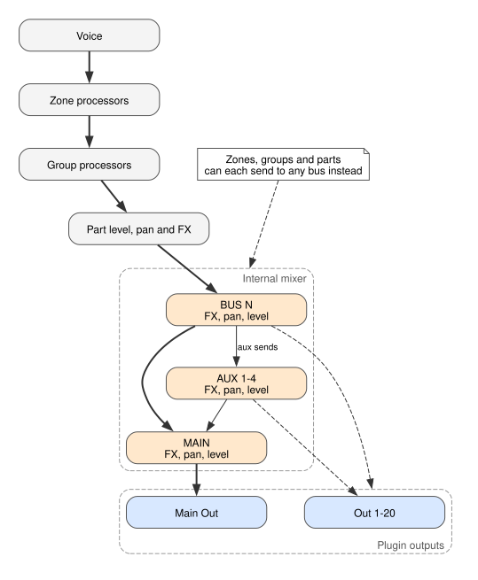

## The default path

1. Each voice runs its zone's processors.
2. The voices of a group are summed and run the group's processors.
3. The groups of a part are summed, then the part's level, pan and four FX are applied.
4. The part plays into its own bus, **BUS N**, which runs its FX, pan and level.
5. **BUS N** plays into **MAIN**, which plays out of **Main Out**.

## Changing the path

Zones, groups and parts each have an output setting. By default it sends audio on to the next
level. It can instead send straight to **Main**, **Bus 1** to **Bus 16**, or **Aux 1** to
**Aux 4**.

- **Zone output**, in the zone **ROUTING** pane. The default is **Group Output**. Choosing a bus
  skips the group and the part.
- **Group output**, in the group **ROUTING** pane. The default is **Part Output**. Choosing a bus
  skips the part's level, pan and FX. The bus can belong to another part.
- **Part output**, the **OUT** button on the part card. The default is **Part Default**, the part's
  own bus. Choosing a different bus moves where the part's FX output goes.

## Aux sends and plugin outputs

Each part bus has four aux sends, one to each aux bus, taken **Pre-FX**, **Post-FX, Pre VCA** or
**Post VCA**. Aux buses play into **MAIN**.

Any part or aux bus can instead go to a plugin output, **Out 1** to **Out 20**. A bus sent to a
plugin output no longer plays into **MAIN**.
