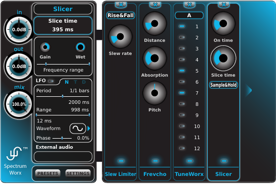

SpectrumWorx is a modular spectral processor. It decomposes your audio into the frequency
domain, lets you stack and chain effects on that spectrum, then resynthesizes the result.

It was originally developed and released by Little Endian, where development ended in 2016.
The plugin was open sourced in 2024, and the Surge Synth Team picked it up in 2026 to
modernize it. It is now available as CLAP, VST3, AU, and a standalone application on Windows,
macOS and Linux.

To ask questions, report bugs or issues, or help develop SpectrumWorx, visit the
[Surge Synth Team Discord server](https://discord.com/invite/spGANHw).

A [PDF version of this manual](/spectrumworx-manual.pdf) is also available for download.

## Welcome!

Thank you for installing SpectrumWorx, one of the most advanced audio processors currently
available! We are sure you will find SpectrumWorx to be an invaluable addition to your sonic
toolkit. Though it shares a name and a philosophy with the original SpectrumWorx 1 plug-in from
which it was derived, this version 2 of SpectrumWorx has been rebuilt from the ground up to
better suit (and take advantage of) today's advanced technologies.

## What is SpectrumWorx?

SpectrumWorx is a modular spectral processor. You may be familiar with modular synthesizers,
wherein the user is allowed to select the types of components to be installed and how they
should be routed. SpectrumWorx works in a similar fashion, except that it acts as an effects
device. SpectrumWorx is not an instrument. Using an attractive, intuitive interface, it allows
you to decide which processing modules should be installed at a given time and how they should
be arranged. Each module is a sophisticated audio processor in and of itself, with its own,
unique selection of adjustable parameters. Most of these can be modulated automatically using
independent SpectrumWorx LFOs. In addition, certain modules can be side-channel driven, using
either the built-in SpectrumWorx external sound file support or by utilizing side-channel
routing in hosts that support it.

There are over fifty individual modules to choose from and as many as five may be loaded into
SpectrumWorx at any time. You can arrange and rearrange them as you like without interrupting
the signal being processed, making it ideal for processing on the fly.

## What is "Spectral" Processing?

We'll keep this bit basic, no need to break out your calculators and slide rules. After all,
you probably want to get on with playing with SpectrumWorx — you didn't come here for a science
lesson!

You are almost certainly familiar with the standard sorts of effects processing used by
professional recording engineers on nearly every commercial recording. Your DAW (Digital Audio
Workstation) probably came with a bundle of the usual suspects: reverb, delay, phasers,
compressors, equalizers and so on. These "bread and butter" effects originally derived from
hardware devices and are therefore somewhat limited in scope. Essential, yes, but hardly the
stuff of revolution. The effects included with SpectrumWorx, however, manipulate signals in ways
that were simply not possible before advances in modern computing technology provided
developers with the processing power required to dig deep into a digitized audio signal.

The effects in SpectrumWorx draw upon complex algorithms designed to analyze a signal and break
it down into its many frequency components. Once that has been done, we can manipulate and
rearrange those components at will. In this way, we can get at the very heart of the sound,
manipulating it bit-by-bit. We can adjust the pitch in unusual ways, or affect the timing in
interesting ways... or both. The entire frequency spectrum is at our disposal. If you know
something about synthesis techniques, then you are probably nodding your head and saying to
yourself "that sounds a bit like additive (or granular, or frame, or FFT) synthesis" and you'd
not be far off the mark.

In days past, such analytical audio acrobatics were performed strictly offline. The engineer was
forced to sit back and stare at an hourglass on the screen while the computer chewed on the
numbers. Today, these things happen virtually instantly and such effects may be used in
real-time, just as a guitarist might use a distortion box, tweaking and adjusting even as the
notes ring out. SpectrumWorx does its magic in real-time and, unlike some processors, won't
interrupt the signal (or the inspiration!) with any annoying clicks or dropouts.
