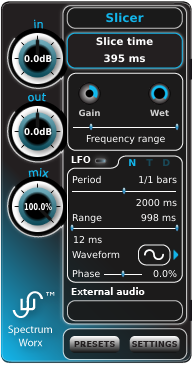

We've already briefly discussed the main plug-in window, but a little more detail might be in
order. As we've said, many of the components that occupy the main plug-in window change to
reflect the selected module and module parameter's settings. For instance, a module's knobs will
give you an idea of how they are set, but the details of those settings are revealed in the main
plug-in window.

## In, out, mix

These knobs are always in view, and they tell us pretty much what we'd expect, given their
names. The **input** knob is used to control the signal level coming into SpectrumWorx, while
the **output** knob adjusts the gain of the outgoing signal. The **mix** knob controls the ratio
of the "dry" and "wet" (unprocessed and processed) signal output. A value of 0% produces an
entirely unprocessed signal, while 100% will allow us to hear only the processed audio. A 100%
wet signal is desired when SpectrumWorx is used on a mixer's auxiliary "send" — though you can
certainly crank it up to full-blast whenever you like!

## Module name, parameter name and value

As we said earlier, the top-most field in the main plug-in view reveals the name of the
currently selected module. Here, it is the Slicer module. Below that is a parameter field which
tells you the name of the currently selected parameter on that module. In this case, "Slice
time". Just below that is the value of that parameter.

## Module gain, wetness and frequency range

These three controls are available for every module. They are shown only if a module is
selected.

- **Gain** controls the gain applied to the signal at module output.
- **Wet** specifies how module input and output signals are to be mixed.
- **Frequency range** specifies exactly what the name says: the frequency range inside which the
  module operates. Outside the range, the signal stays unchanged.

All four parameters — gain, wetness, start frequency, and stop frequency — are controllable by
the LFO too.

## External audio

Many SpectrumWorx modules work by processing and combining main audio input with side channel
audio. These side channel files are loaded (and unloaded) via left (and right) mouse click in
the "External audio" area of the main plug-in window.

There are a few known limitations:

- Audio files are not streamed, but are fully loaded into memory, hence their length is limited
  by available memory.
- 8 bit, 16 bit and packed 24 bit sample resolutions are supported.
- Mono and stereo channel configurations are supported.
- All plugin programs share the same sample.
- SpectrumWorx automatically tries to resample the external sample to match the main channel's
  sample rate. However, the resampling will only work if the target sample rate is 48 kHz or
  lower.
- Changing the active sample rate (in your host) does not automatically resample a loaded
  sample; it has to be manually reloaded.

One final important note to remember is that a loaded external audio file takes precedence over
the signal received from a side channel input.
