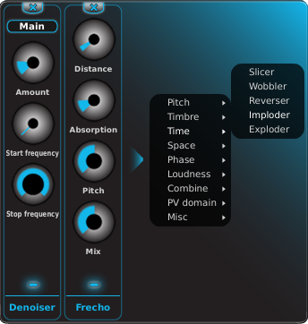

The Module Bank is designed to hold modules. You can have five modules at any given time. The
signal flows from the left-most module to the right.

## Loading modules

Modules are loaded by clicking the arrow at the left of the Module Bank and selecting a module
from the categories shown in the pop-up menu.

## Muting, deleting and rearranging

In addition to the individual parameters, each module has a **mute** switch, which takes the
form of a blue LED at the bottom. On the very top of each module is an **x** used to delete that
module from the Module Bank. Deleting a module to the left of any other modules will cause the
remaining modules to slide over to occupy the deleted module's former position in the Bank.

Any module can be dragged and dropped, making rearranging a sound a snap. Dragging a module into
a new position most often results in an entirely new sound!
