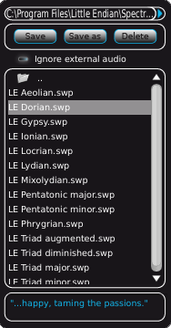

Like the Settings window, the Presets browser is a collapsible "child" window that appears along
the left side of the SpectrumWorx interface. As you'd expect, it is used to search for, load,
save and manage the many factory presets, along with any you might want to create for yourself.

## Location

The directory where you keep your presets is displayed at the top of the window.

## Save, Save as, Delete

Save, Save as and Delete buttons are available just below the preset location. When you elect to
**Save as** your own preset, you'll be provided with an opportunity to give it a name. Use the
**Save** button to overwrite an existing preset, which you need to select first. Use the
**Delete** button to remove any existing or selected preset that you no longer want to have
available to you.

## Ignore external audio

The **Ignore external audio** option allows you to skip the loading of external audio files from
other peoples' presets, or the saving of the currently loaded external sample into your presets.
This is useful if you want to test existing presets with your own audio sample.

## List

The preset list shows the preset files and the subfolders available in the current folder for
easy navigation. Single clicking on a preset name automatically loads the preset. A double click
or a press of the enter key gives you the opportunity to rename a preset.

## Description

There is a description field just below the preset list. This is a place where you can write
(just single click inside the field) or read descriptions of, or comments about, selected
presets. This goes a long way towards helping to keep all of the presets manageable.
