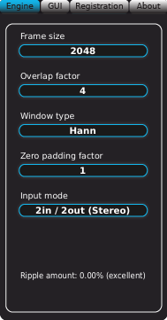

Hold on to your beanies, boys and girls, this is where we start to get a little technical! The
Engine settings are where you tell SpectrumWorx exactly how much effort to put into its
algorithms, as well as how its inputs and outputs should be arranged. We'll start at the top and
work our way down.

There may be times when you find that you are putting a lot of strain on your CPU and you might
feel the need to fiddle with the Engine a bit to relieve some of the stress on your computer.
There may also be times when you intentionally dial in settings that will compromise the
incoming signal in interesting ways. You should note that the engine settings are saved in
presets, so don't be surprised if you fire up a new preset only to find that your engine
settings are suddenly changed!

All engine parameter changes take effect immediately and it is not required to stop the playback
beforehand; SpectrumWorx was designed and thoroughly tested to take almost anything you throw at
it. However, unlike for plugin stability, we cannot guarantee sonic stability. If your playback
is active, depending on the changes you make and on the loaded modules, you may hear (very) loud
transient noises — which may also sound cool sometimes — until the signal stabilizes with the
new settings.

Note that changes to the engine setup parameters affect the plugin's latency and/or its I/O
configuration and therefore require cooperation with the host software, which means that the
stability of the whole process relies not just on SpectrumWorx but also on the host. It may
happen that you run into a rare host that does not like these things to change while playback is
active (especially in a very rapid manner, like fast scrolling through the presets with
different engine setups) in which case you can try stopping the playback/transport before
tweaking the engine parameters.

## A brief diversion into how SpectrumWorx does its thing

To fully understand how some of the Engine settings work, you need to know a little about how
SpectrumWorx itself operates. SpectrumWorx uses what is referred to as the "Short Time Fourier
Transform", which we'll abbreviate as "STFT" (to avoid Carpal Tunnel Syndrome!). The learned
among you may be familiar with DFT, or "Discrete Fourier Transform", or FFT (Fast DFT) and will
know immediately what we're talking about.

Put as simply as possible, a Fourier analysis breaks down a signal into individual frequency
components. In audio, you might use such a process to identify and separate individual harmonics
or groups of harmonics. If you understand that any given sound may be broken down to nothing
more complex than a pile of simple sine waves, each with its own frequency and phase, then you
can begin to see how powerful such an analysis can be! This is, as we stated earlier, the basis
for additive synthesis.

In the case of STFT, short segments of sound are analyzed, rather than the whole signal. This
has a few benefits. First, and most obviously, it is faster and therefore more amenable to
real-time manipulation. And it has less delay. But what is most important, it is also similar to
the way our own hearing works. The ear similarly analyzes only a short segment of audio at a
time (on the order of 10-20 ms worth). Therefore, to perform a spectrum analysis having time and
frequency resolution comparable to human hearing, we must limit that window of time accordingly.
The proper way to extract a short time segment from a longer signal is to multiply it by a
window function. We'll talk about window functions a bit later.

## Frame size

Now, if you've read the above paragraph, you may be able to understand how setting the Frame
Size affects our signal. A shorter frame means that we will be able to capture fast changes of
the input signal, while a larger frame size will provide a more accurate frequency analysis
(since STFT gives us just an approximation of the input spectrum). This comes from the fact that
STFT presupposes a fixed spectrum for the entire duration of the frame.

Your signal's quality as well as the overall sound is going to greatly depend on the Frame Size
setting. Some modules are even targeted to specific frame sizes. Phasevolution, for example,
will give best results with short frames (for 44100 and 48000 Hz sampling frequencies).

SpectrumWorx offers seven different frame sizes, ranging from 128 samples to 8192 samples. This
figure directly coincides with the number of frequency components that will be produced.

If you choose a frame size of 128 samples in the time domain, then this chunk will be
approximated with 128 frequencies (as we said, STFT is just an approximation). A value of 128 is
in fact rather low, but the trade-off in this case would be that your time resolution would be
high, resulting in an ability to capture fast changes without smearing them in time. If the
input sampling rate is 44100 Hz, then 128 samples would represent less than 3 ms of signal —
which is a very good time resolution. At the same time, an input frequency spectrum range of
22050 Hz would be approximated with only 128 uniformly spaced frequencies, i.e. one frequency
component every 172 Hz, which is rather poor.

Conversely, a setting of 8192 would provide excellent frequency resolution, but wouldn't be so
great in the time domain — chunks analyzed would be 185 ms long in this case. On the other hand,
an input frequency range of 22050 Hz would be approximated with 8192 frequency components, which
is a great frequency resolution of less than 3 Hz!

A good compromise between time and frequency resolution would be a frame size of 1024 or 2048.
This also is the best match to the human auditory system's time resolution.

It is important to note that shorter frames consume more CPU than longer ones, because of the
overhead of running the whole process more often.

## Overlap factor

We just keep hitting you with these technical terms, don't we? Suffice it to say that the longer
the overlap, the smoother the results across time. SpectrumWorx allows you to choose four
values: 0% (no overlap), 50% overlap, 75% overlap and 87.5% overlap. A setting of 75% or higher
is required for proper pitch shifting. The "best" or "optimal" overlap also depends on the
window type you choose, but 75% is typical and recommended.

If the window and STFT are applied to non-overlapping partitions of the signal, a significant
part of the signal is lost due to most windows exhibiting small values near the boundaries (not
true for the Rectangular window!). To avoid this loss of data, the transforms are usually
applied to overlapping signal sequences. The overlap factor tells us how much we can advance the
analysis time origin from frame to frame. In SpectrumWorx, an overlap of 75% means that it takes
4 steps to move one whole frame ahead in time.

Longer overlaps also mean more processing, so your CPU meter is going to go up accordingly. An
overlap of 87.5% (factor 8) combined with a short frame length might just not be too healthy for
your CPU!

## Window type

We've already discussed the importance of the window's frame size, but the window's "shape" is
also a factor in achieving good results. The main problem is that windowing causes the signal's
Fourier transform to have non-zero values (commonly called spectral leakage) at frequencies
other than those really present in the signal. Windowing is in fact used to shape and reduce the
spectral leakage! We could say that windowing describes how the signal is "seen" by the analysis
algorithm.

Think of two sinusoids with different frequencies: spectral leakage can interfere with the
ability to distinguish them spectrally. If their frequencies are dissimilar, then the leakage
interferes when one sinusoid is much smaller in amplitude than the other. That is, its spectral
component can be hidden by the leakage from the larger component. But when the frequencies are
near each other, the leakage can be sufficient to interfere even when the sinusoids are equal
strength; that is, they become unresolvable.

The easiest windowing operation is simply truncating the signal on the left and right at frame
boundaries. This can be modeled mathematically as a multiplication of the signal by the so-called
Rectangular window. The Rectangular window has excellent resolution characteristics for signals
of comparable strength, but it is a poor choice for signals of disparate amplitudes. This
characteristic is described as low-dynamic-range.

At the other extreme of dynamic range are the windows with the poorest resolution. These
high-dynamic-range low-resolution windows are also poorest in terms of sensitivity; that is, if
the input waveform contains random noise close to the signal frequency, the response to noise,
compared to the sinusoid, will be higher than with a higher-resolution window. In other words,
the ability to find weak sinusoids amidst the noise is diminished by a high-dynamic-range
window.

In between the extremes are moderate windows, such as Hamming and, the default window in
SpectrumWorx, Hann. The Hann window provides a good compromise and works well for general audio
analysis, so it can be a good place to start!

In summary, choosing a window involves a tradeoff between resolving comparable strength signals
with similar frequencies, and resolving disparate strength signals with dissimilar frequencies.
SpectrumWorx provides nine different window types to choose from: Hann, Hamming, Blackman,
Blackman Harris, Gaussian, Flat top, Welch, Triangle and Rectangle. Go experiment!

## Ripple factor

You'll notice the Ripple factor displayed at the bottom of the page. This tells you if the
current engine settings (Frame Size, Window Type, Overlap) will result in a so-called "perfect
reconstruction" of the sound, or if some ripple will be introduced by the engine itself
regardless of the modules being used. Successive windowed frames should overlap in time in such
a way that all data are weighted equally — this produces no ripple.

Different window types have different frame sizes and overlap factors where they produce no
ripple. For example, a Rectangular window can advance (overlap size) by (Frame Size)/k samples,
where k is any positive integer, and a Hann or Hamming window can use any step size of the form
(Frame Size/2)/k.

## What is the best engine setup?

In SpectrumWorx there is no "best engine setup". Modules differ vastly in the engine parameters
they work best with. It is up to the user to find that happy compromise between frequency
precision and time resolution, or between sonic integrity and bringing your computer huffing and
puffing to its knees.

## Input mode

This bit is mostly self-explanatory. SpectrumWorx offers a variety of input and output modes
tailored to various needs. By default, 2 in / 2 out (Stereo) is assigned, but you can switch that
over to mono operation, or choose one of the modes designed for use with side-chaining effects.

When supported by the host, side-chain input modes are a powerful alternative to the built-in
external sound file functionality. In fact, you will probably want to use the host's side chain
facilities as the side chain source for your setups and presets with two-input modules in your
final production phases, as this will give you far greater control and power over what and how
exactly is fed into the SpectrumWorx side chain input. You will have to consult your host's
manual to find out if it supports side chain routing and how to set it up.

In addition to side chain modes, the mono modes can be useful in situations where you are
working with individual mono tracks and wish to achieve the maximum sound fidelity (primarily in
terms of phase coherence and stereo imaging). You can load up multiple SpectrumWorx instances
with each working on a different track; you will, for example, notice that Phase Vocoder based
modules sometimes give better results that way.

The SpectrumWorx engine is not actually limited to the basic I/O modes which are made easily
accessible through the SpectrumWorx GUI and the Input mode parameter. If your host provides the
means, you can set SpectrumWorx up to work with more complex channel arrangements, such as
8-in / 4-out modes.
