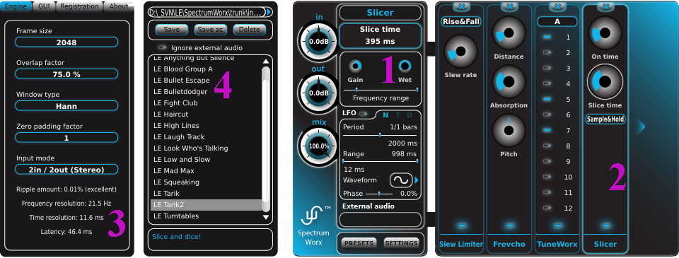

A lot of musicians tremble with trepidation when they hear the term "modular". It brings to mind
towering monolithic synthesizers festooned with hundreds of knobs, patch points and obscured by
dozens of dangling cables. Fortunately, the SpectrumWorx GUI is a study in user-friendliness.
Everything you need at any given moment is right in front of you, and there are only a few (and
rarely needed) bits tucked away where they won't interfere with your work until you need them.

Let's take a look at the various components that make up the SpectrumWorx user interface, using
the numbered screenshot guide as a reference.

## 1 — The Main window

The Main plug-in window is labeled as **1**. Some of the items in the Main plug-in window are
always present, including the In, Out, and Mix knobs, Presets and Settings launch buttons and
the area used to load external audio (Load and Unload buttons). Other, variable fields will
change, depending on which module is selected, and even which parameter on the selected module
is selected. The name of the currently selected module appears at the top, while the currently
selected parameter and its value will be displayed just below the module name.

Below the currently selected module and its parameter value you will find the three controls
related to the module which is currently selected, and those are: Gain knob, Wet knob, and
Frequency range slider. This means that each module has separate gain, wetness and range.

Below the shared module parameters you will find the LFO section. The LFO settings are unique to
each selected parameter, and the various fields in the LFO section will reflect the values
specific to that selected parameter. We'll talk more about LFOs, what they are, and how you can
use them a little later.

## 2 — The Module Bank

You will find the Module Bank to the right of the Main plug-in window labeled as **2**. This is
the area into which the many different SpectrumWorx effects modules may be inserted. In our
numbered screen grab we have four modules loaded into the Module Bank (a Slew Limiter, Frevcho,
TuneWorx and a Slicer). As you can see, our Slew Limiter for example has a total of two
controls, one combo box and one knob, each controlling a different parameter. Each of the
controls can, as we suggested above, be modulated by its own LFO.

## 3 and 4 — Settings and Presets

We've labeled the Settings window as number **3** and Presets as number **4**. These windows are
left hidden until you need them.

You will access the Settings window when you want to adjust the engine's various analysis
parameters, alter the GUI, or read the "About" page to find out the software version and who is
behind SpectrumWorx.

The Presets child window you can open when you need to load or save presets.

## About that CPU

SpectrumWorx uses complex algorithms designed to take advantage of today's powerful desktop
environments. As such, it can consume a lot of resources. However, the SpectrumWorx engine, with
its emphasis on quality as well as stability, is still an efficient performer. The processing
required will vary dramatically, depending on which modules are installed in the Module Bank
(most modules consume only up to 1%) and upon your Engine settings. For example, adjusting the
Overlap, Frame length and/or the number of channels can significantly affect the hit on your
computer. We'll discuss those settings momentarily.

## Caution: watch those levels!

As is the case with any modular system, routing and processing signals through SpectrumWorx can
sometimes provide unintended results. The signal can get loud, with the potential to damage your
speakers and your hearing. Please exercise the same discretion when using SpectrumWorx as you
would with any equipment that can produce excessive amplitudes. SpectrumWorx is all about
experimentation and we encourage you to dive right in. However, you should be ready to hit that
Bypass button. Better yet, keep your overall monitoring levels turned down until you have
achieved the sound you want to make.
